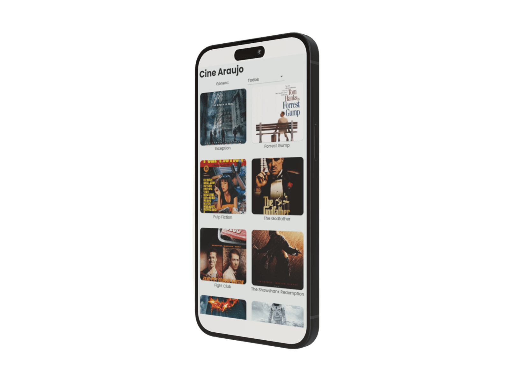
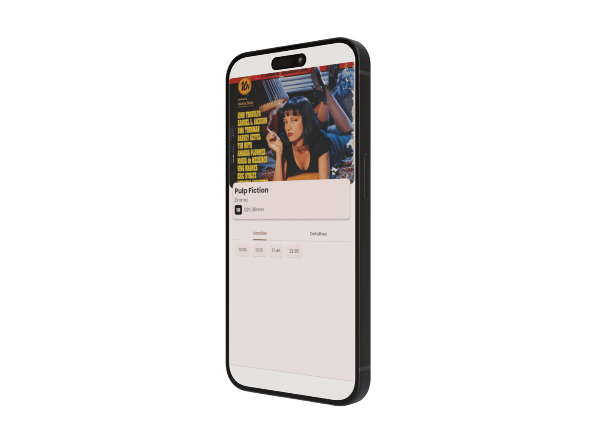

<h1 align="center">
  Cine Araujo
</h1>
  

  

  

<h2> :information_source: Descrição </h2>

 Projeto criado através de um curso na Alura para implementação do gerenciador de estados BLoC com Cubit

  

<h2> :globe_with_meridians: Objetivo</h2>

O projeto tem como objetivo trazer uma lista com alguns filmes (simulando uma bilheteria) separados por gênero, onde o usuário irá conseguir selecionar o gênero (em um dropdown). O usuário também conseguirá ver também a descrição do filme e suas sessões, ao clicar sobre o filme escolhido.

  

<h2> :iphone: Telas</h2>

  
  

  

<h2> :hammer_and_wrench: Abrir e rodar o projeto </h2>
<h4>Aqui vem um passo a passo para abrir e rodar o projeto.</h4>
<ul>
  <li> Faça o download do arquivo </li>
  <li> Procure o local onde o projeto está e o selecione (Caso o projeto seja baixado via zip, é necessário extraí-lo antes de procurá-lo) </li>
  <li> Por fim clique em OK </li>
  <li> Depois basta rodar o comando `flutter run` na pasta do projeto </li>
</ul>
  

<h2> :computer: Tecnologias Utilizadas</h2>

  
  
Flutter

  
  
BLoC

  
  
Cubit

<h4 align="center">
  :white_check_mark: Projeto Concluído
</h4>